# Pogs user manual

Welcome to the pogs user manual. The purpose of this document is to give a broad overview of the system inner works, and provide a basic tutorial on how to create a study from beginning to end.

## System overview
The POGS system is structured in a way that helps it achieve the execution of a set of online tasks by groups of individuals, that can interact and communicate with each other with several different configurations.
Using POGS for executing online group tasks starts with creating a **Study**.

### Study
**Study** is a container of several **Sessions**. Normally a **Study** will have conditions that will be applied to the **Sessions** either in the form of configuration changes, or different subject groups.

A **Study** is attached to a **Research Group**. Only those users associated with the **Research Group** attached to the **Study** will be able to see the study info and its associated sessions, and access their configurations.

### Session
A **Session** is an event that uses a set of pre-configured settings that allow **Subjects** to perform a set of **Tasks** in a predefined time period.  A **Session** can be (a) *scheduled* to start at a specific date and time or (b) set as a *perpetual* session, which is open for a set period of time and can start whenever criteria for starting a session are met.  

The session has the following lifecycle:
--

1. **Initial state** (before any scheduling is done)
2. **Scheduled state** (the session has a date to start and is waiting until that time comes, or if all subjects that were set to participate check in.
3. **Running state** (the session is running and the subjects are interacting.
4. **Final state** (the session has gathered all data from its execution, the scoring is done and all data is ready to be exported or replayed.

#### The session page flow

The subjects check in and if the session is set to start in at least 10 minutes they are redirected to the waiting room page, if not they are shown a message that says he/she is too early.

The session are composed of a sequence of pages that the subjects are automatically guided through.

This is the current session page flow:

Page number         | Page           | Description     |
--------------------|------------------|------------------|
1 | Check in page   | The page asks for the external id the researches sent before the session starts.   |
2 | Waiting room   | The page were subjects that have successfully checked in will wait for the session scheduled time or wait until the desired amount of subjecst check in.   |
3 | Session intro page   | If set this page will be displayed to all subjects before all else, this is usually good time to explain how the session will run and give extra information like the communication capabilities and how they are expected to work   |
4 | Diplay name   | If set we allow the subjects to change their display names. By default they will be set equal to the external id or set to what the researcher set them to be.
5 | Team roster   | If set we allow the subjects to see their team roster before the tasks begin.
6 ... n| Task states | The task states will be described in a following section.
n ... n+1| Done page | If set the final page is displayed  and if set the scoreboard is also displayed.
n+1| Redirect | If set we redirect the user to a final URL.

##Task
Tasks are the activities that the subjects will be asked to work on during the session. Tipically a task is a challenge that can be done either in a group setting or in solo mode. However before the actual work the task can have some extra pages following a page flow described next.

### The task page flow 

The tasks also have a sequence of pages, that the subjects are automatically guided through. 

If the session was set to allow tasks to be run in parallel the **tasks will only have the work stage**.

Page number         | Page           | Description     |
--------------------|------------------|------------------|
1 | Task Intro   | If set in sequential mode and if set to true, the system displays the intro information.   |
2 | Task Primer   | If set in sequential mode and if set to true, the system displays a primer page for information regarding the task like an image or a set of words to be memorized   |
3 | Task work   | This is the actual task work page that the subjects will work and interact with each other.|

#Tutorial:
This tutorial will guide the researcher to create a working study with a session. 
## Create researh group
The first step after [login](http://baphomet2.mit.edu/login) is to either create a research group or assing one to the current user.
This can be done in the [Admin home](http://baphomet2.mit.edu/admin):
To create a new research group click in **Research groups** .
To change the research group associated with a user click in **Users**.

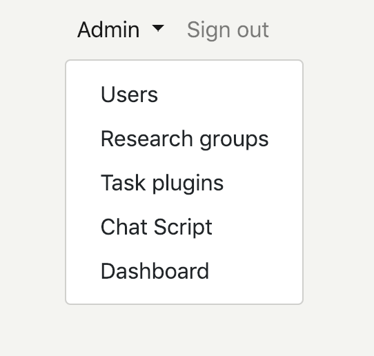

## Assign research group to user
To assign a research group just make sure that the research group name is on the box to the right. Clicking on the research group name will send it to the box to the right. You can undo the action by clicking on the research group name, this will send the research group back to the left panel. After it has the desired setup of research groups, click **Save user**.

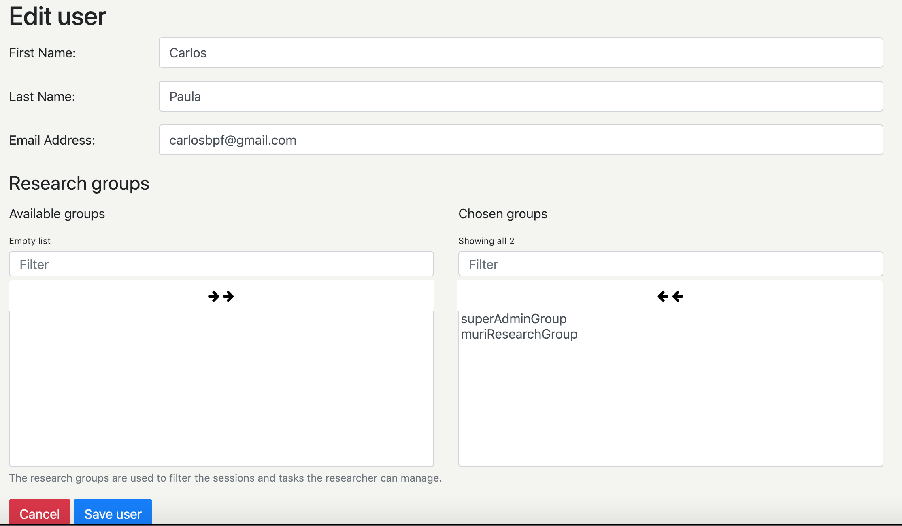

## Study
As described before the study is a container of sessions. All the sessions your user can see are listed in [this link](http://baphomet2.mit.edu/admin/studies).
To create a new session just click the button, to edit a current session click on its name on the listing page.
The study has the following fields:

- Study name - How it is going to be referred in the future.
- Description - A more detailed description of the study.
- Session prefix - This is a prefix that will be applyied to all sessions , usually letters and numbers without spaces or special characters.
- Research group - This association will enforce who has the ability to see and edit the study. **Make sure to include at least one of the research groups your user is associated with otherwise you will not be able to edit this study after saving.**

To save or create just click on the blue button. Or hit cancel to undo any unsaved changes.
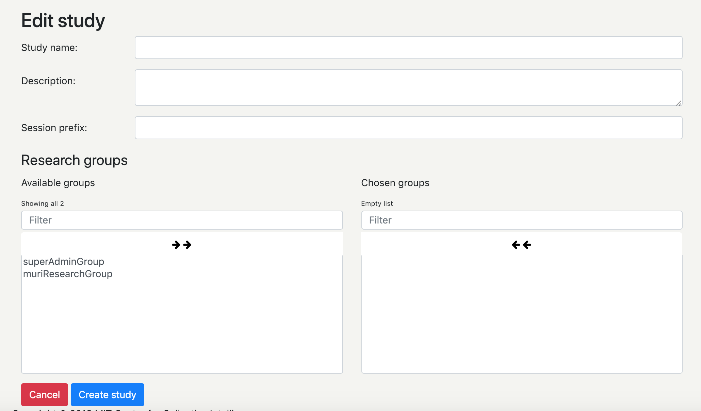
## Task Plugin Configuration
All tasks in the POGS system will have a task plugin associated with them. All the plugins can be seen by clicking on the admin menu **Task plugin**.

There are several types of plugins. Ideially the researcher already created the list of tasks he wants to run beforehand. So this is the step to create a configuration that will reflect what you want from a task using the desired plugin.

All plugin configuration will be different, but all of them will have the  configuration name field. Remember the name you gave to the configuration because it will be needed in the next step.

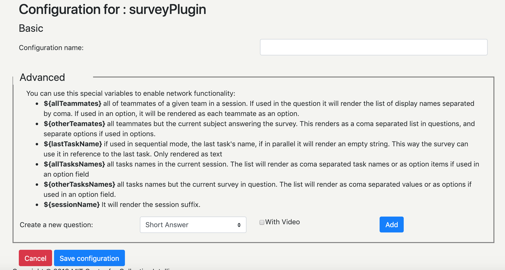
## Task
Creating a task can be divided in may areas:
### Basic configuration

- Task name - As the task should be refered to, this will be used in the data exporting
- Task plugin type - The plugin that is task will be using.
- Task plugin configuration - The configuration name created in the task plugin configuration step. The list will be filtered after selecting the task plugin type to show only the ones that belong to that task plugin.
- Solo task - This will make this task execution be in solo mode. All subjects will see the task but it won't be shared between them, each subject will have their results saved separatedly.
- Should score - This will run the task scoring algorithm after the task execution. The task plugin has the implementation logic for the scoring, and the data should be saved in the [task plugin configuration step](#taskPluginConfig)

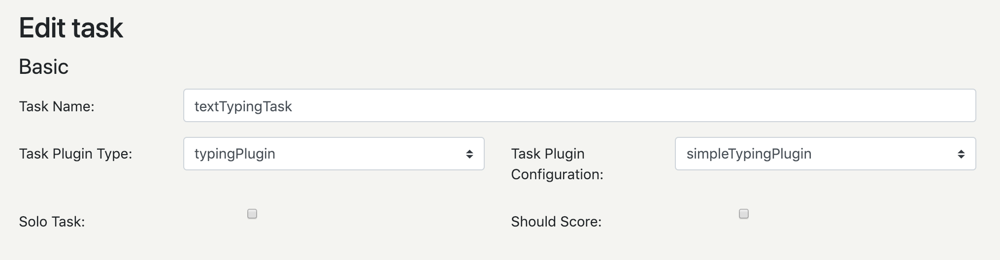

### Pages
As discussed in the task page flow [section](#taskPageFlow), there are pages that the task can use:

- **Intro page enabled** - Intro is a page to display information to help the subjects in doing the task itself. Ex.: Please fill all the squares with the appropriate answer for the sudoku game.
    - **Intro time** is the ammount of seconds this page will be displayed, before redirecting the subject to another page. 
    - **Intro text** is the content to be displayed to the subjects.
- **Primer page enabled**- Primer is a page to display data related to the task. Memory tasks usually use this page to display images or words to be memorized. 
    - **Primer time** is the ammount of seconds this page will be displayed, before redirecting the subject to another page. 
    - **Primer text** is the content to be displayed to the subjects.
    - **Primer video should autoplay muted** this is only used if there is a video embeded in the primer's content, and the researcher wants it to be auto played in sync at page load, because of Youtube's restriction this can only work if the sound is muted.
- Interaction page - This page is mandatory, it is where the task plugin will run and where the task will be executed.
    - **Interaction time** is the ammount of seconds this task will allow users to work on before redirecting it to another task.
    - **Interaction widget enabled** if set to true will display the contents of the next field **Interaction text** on a left side panel, on the task work page.
    - **Interaction text** content to be displayed to the subjects.

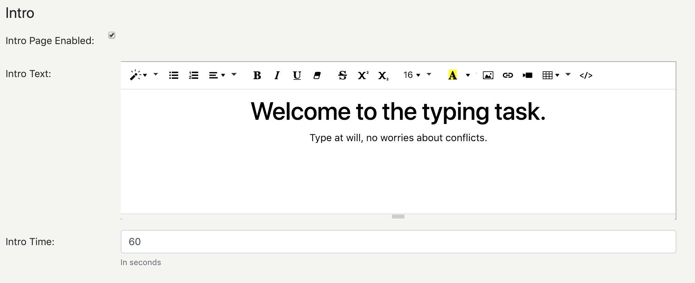

### Communication
The communication configuration can be set to allow users to use different communcation methods.

The four types of communication:

- **No chat** - No communication will be allowed.
- **Group chat channel - no constraint** - A group chat panel will enable users to send messages in broadcast to everyone in the same session he is in.
- **Matrix chat constraint** - the chat widget will allow subject that have permissions to communicate based on a communicatio matrix that will be defined in the session configuration section, this matrix defines not only the other subjects but also sub channels that the user may belong to, these channels behave just like the group chat.
- **Dyadic communication constraint.** This constraint will only allow billateral communication after a process of request chat - approval response is done. Subject ***A*** will send a chat request to subject ***B**. Subject ***B*** approves and then their private message panel allow them to exchange messages. Once one of the two click the **Close communication** button the chat ends on both sides, like a phone call would.
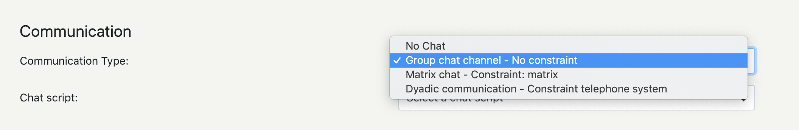

The system can also send messages automatically, following a script.
The **Chat script** field can be set to the desired script, which can be created at the **Chat script** item in the **Admin** menu.

Important disclaimers

Obs1:If the task is set to solo, any chat configuration wont allow any communication because the only subject on that task is the current solo subject. It is advised to set the communication to **No chat**

### Collaboration

The collaboration configurations can enable widgets that are handy helpers to organize and divide work among the subjects. These tools are only used by the subjects themselves, the researcher can only enable/disable them.

- **Todo list** - this enable the subjects to create todo items, that can be self assigned/unnassigned, marked/umarked as done.
- **Voting poll widget** - this enable the subjects to create voting polls with different options that the subjects can vote one. Each subject can select only one option for each poll.
- **Collaboration feedback widget** - this enables a graph bar (sum to 100%) to display each subject contribuition to the task at hand. This is a quantitative display of work between the subjects.

###Research group
This panel allows the researcher to select the research groups this task will be available to.

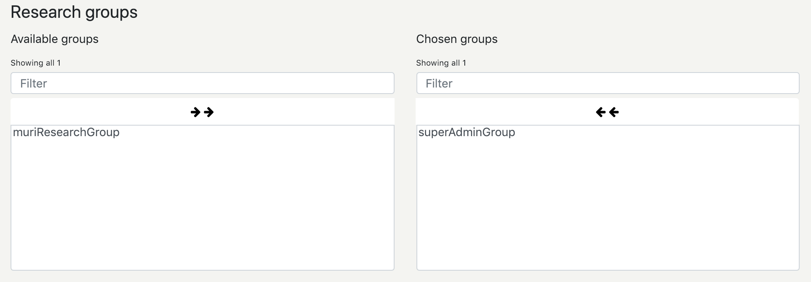

**Beware that if you do not add at least one research group you belong to, the task will not be accessible to you.**

## Task group 
The task must be grouped together to be used in a session. 

This is done in the edit/create task group [page](http://baphomet2.mit.edu/admin/taskgroups/create).

- **Task group name** - is the name by which this group will be refered to. This name will appear on the session configuration screen.
- **Add task to task group** - this button adds (appends) the currently selected task to the task group.
- **Trash icon** - removes the selected task from the task group
- **Drag and dropping** - Tasks can be drag & dropped to change their order of execution. The number before the task name indicates the order of execution of each task.

You must either create/save the task group for the changes to be saved.

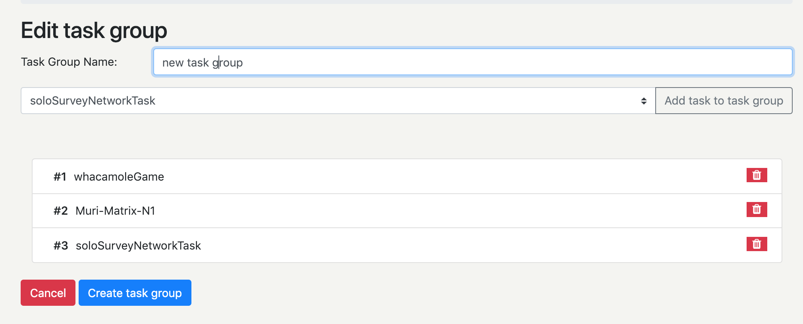

## Session
With all the previous steps you should be able to create a new session for your study. Remember that you can always reuse tasks configurations, tasks, and task groups from previously created ones.
To create or edit a sesion you must first go into the study page in which you would like to create the session.And then click in the session name or in the **Create new session** button.

The session has many configuration fields they are divided as follows:

### Basic configuration

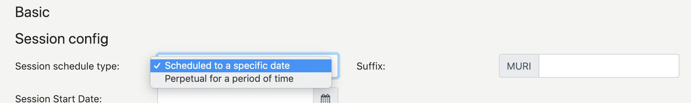

- **Session schedule type** - is how the session should start. There are two options available:
    - **Scheduled to a specific date** - if this is set the session will only allow subjects to join when the session is about to start. It uses the **Session start date** as the date/time the session should start.
    - **Perpetual for a period of time** - if this is set, the session will automatically start as soon as the right ammount of subjects (field **Number of subjects to start session**) is reached. Since the subjects won't be created beforehand, the system will use the **Subject prefix** field to discover that the current subject belongs to this session. This should be a sequence of letters and numbers without empty spaces. The session will accept subjects in the period between the **Perpetual start date** and **Perpetual end date** dates. 
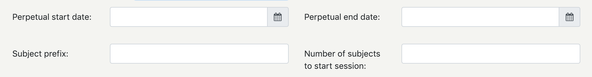
- **Suffix** - here the study session prefix is already filled in, the suffix should probably be a number or a sequence of letters to better identify the session afterwards. 

### Pages
Similar to the tasks, the session also have some pages, they are described in the session page flow [section](#sessionPageFlow)

- **Intro page enabled** - if set the intro page will be displayed
- **Roster page enabled** - if set the team roster page will be displayed.
- **Waiting room time** - this field is not currently used (deprecated)
- **Display name change page enabled** - if set the subject will be able to change his display name to one that he types, instead of the one given by the researcher.
- **Done page enabled** - if set a done page will be displayed. This is the page where the final scoreboard table will be displayed as well if set to be displayed.
### Task execution
The tasks can be executed in three different ways:
- **Sequential, fixed order** - as the name suggests the system will use the order defined in the task grop as a "play list" and will do that sequentially.
- **Sequential, randomized order** - the system will randomize the order of the tasks from the task group, and the tasks will be executed sequentially.
- **Parallel** - the system will allow subject to change between tasks as they please. The time for all tasks to be completed will be defined by the **fixed iteraction time** field.

### Communication & collaboration
The communication and collaboration tools are identical to the task defined ones. Currently this is not working, but the ideia is to have a session wide definition or override that can be either enforced or be the default one if the tasks does not set any configuration for them.

### Feedback
- **Scoreboard enabled** - if set a scoreboard will appear at the done page. 
- **Scoreboard display type** - Ideally in the future we will support the display type to also happen at the end of each task.
- **Use display names** - if set the system will show in the scoreboard the display names (potentially given by the subjects at the diplay change page)
 
### Team composition
The session teams can be composed by different methods and at different moments.

- **Team creation method** - is how the system should creat the teams, the available options are:
    - **Specified by researcher** - the researcher will create the teams before hand (currently not supported)
    - **Randomly selected** - the system randomize the teams of size defined by the **Team size** field.
    - **Randomly selected - based on a matrix** - the system will use the provided **Team creation matrix** to create the teams according to the configuration.
- **Could not assign to team message** - this message will be displayed if the system can not add a subject to a team because the teams were already filled.

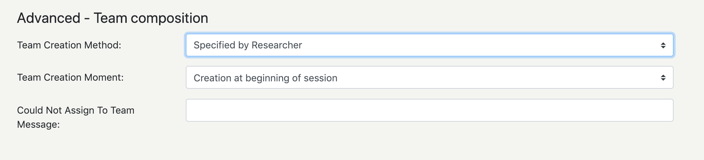
### Task groups
This is where the task groups get associated with the session. You can add more then one task group. The system will only display tasks groups that are associated with the research groups that you belong to.

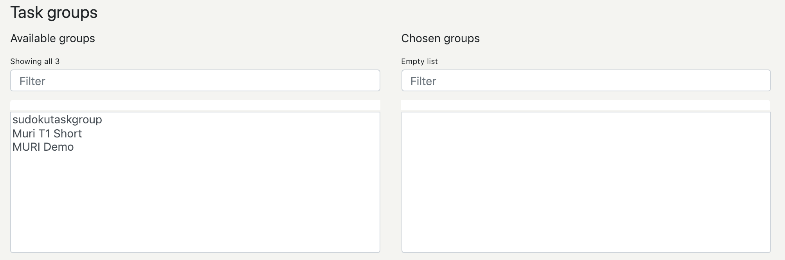

### Subjects
After saving a session, or clicking on one already created the researcher will be directed to a page similar to this:

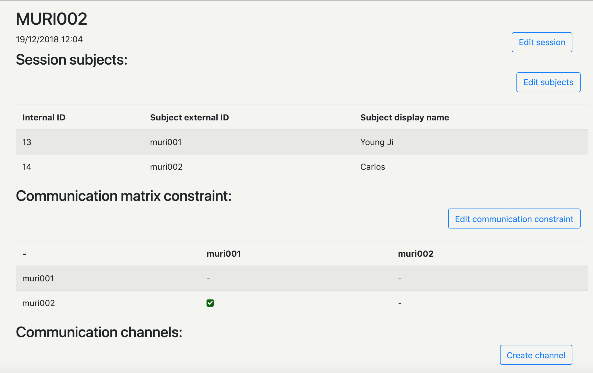

This pages provides the researcher the ability to setup the subjects by clicking in the **Edit subjects** button.

The following fields will be used if any of the tasks uses the *Matrix chat constraint* communication type.

It also allows the resercher to change the current communication matrix constraint by clicking in the **Edit communication constraint**.

#### Edit subjects
This page allows the researcher to do the following:

 - **Add subject** button: add a new subject to the subject list
     - **Subject external id** - is the id the subject will use in order to participate in the study. This can't be changed by the subject. Normally set to letters and numbers without whitespaces.
     - **Subject display name** - is the display name the system will use to identify the subject on the rosters and widgets. This can be overriden by the user if the *Enable display name page* is set to true.
 - **Add attribute** button: adds a new attribute to the subject. This attributes will be displayed when a subject mouses over the team roster. This is to be used to inform other subjects about specific skills or education the subject may have.
     - **Attribute name** - is the attribute name Ex.: *Education level*
     - **Attribute value** - is the the value itself Ex.: *Bachelor in computer science*
 - **The trash icon** will delete the current subject or attribute.

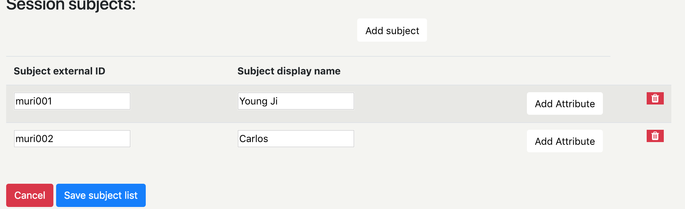
 
#### Edit communication constraint

This page enables the researcher to check which communication will be allowed between the subjects.
If set to true the communication will be allowed, if set to false it won't.

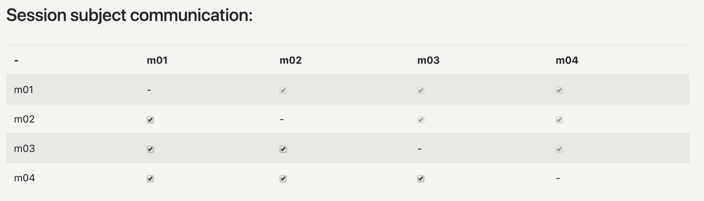

#### Create channel

This page enables the researcher to crate/edit channels similar to group chats that only the selected subjects can view and send messages.

- **Channel name** - the name that will be displayed to the subjects chat under the team roster. This should not be a big name.
- **Subjects** - This panel allows the researcher to select the subjects that should be allowed to talk in this channel

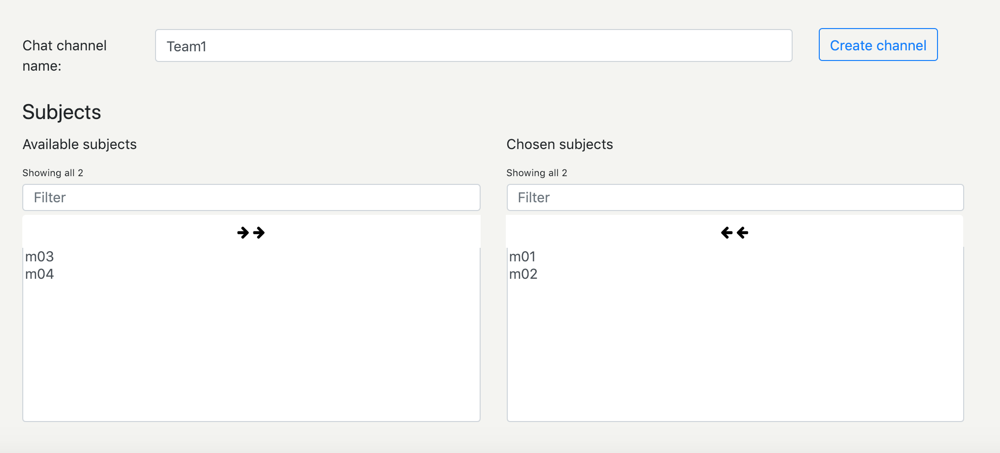
